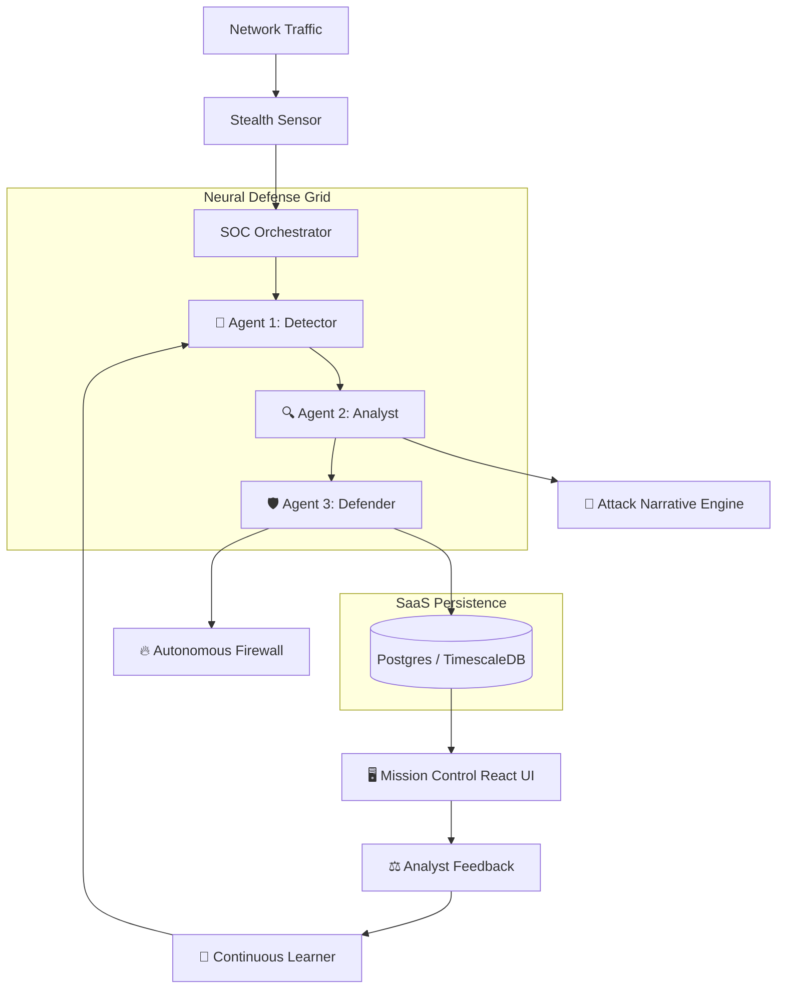

<p align="center">
  
  
  
  
</p>

<h1 align="center">🛡️ StealthVault AI</h1>

<h3 align="center">
  Enterprise-Grade Autonomous Cyber Defense & Prediction System
</h3>

<p align="center">
  <strong>StealthVault AI is a multi-tenant, autonomous SOC platform that leverages deep learning to detect, visualize, and neutralize cyber threats in real-time.</strong>
</p>

<p align="center">
  <em>Autonomous Defense | Predictive Modeling | Multi-Tenant SaaS | Zero-Day Neutralization</em>
</p>

---

## 🚀 The Multi-Agent Intelligence Grid

StealthVault isn't just a dashboard; it's a team of three specialized AI agents working in a recursive neural loop:

| Agent | Core Identity | Advanced Intelligence |
|-------|---------------|-----------------------|
| 🧠 **Detector** | The Neural Eye | Hybrid Isolation Forest + Random Forest. Detects anomalies with 94%+ accuracy. |
| 🔍 **Analyst** | The Strategic Brain | Cyber Kill Chain mapping & Attack Story generation. Predicts the attacker's next move. |
| 🛡️ **Defender** | The Sovereign Fist | Surgical auto-blocking with Multi-Tenant isolation & Neural Safety Gates. |

---

## 🔥 Key Enterprise Features

### 1. 🎭 Live Attack Stories
StealthVault transforms raw packet data into human-readable narratives. It explains **what** happened, **why** it's dangerous, and **how** it will likely escalate. 
> *Example: "Recon → Brute Force. Attacker expected to move to Database Exploitation next."*

### 2. ⚡ Autonomous Neural Defense
The system doesn't wait for your approval. When a threat crosses the **Neural Threshold** (Risk > 0.9 + Confidence > 0.8), the Defender Agent activates its "Surgical Strike" to null-route the attacker at the OS firewall.

### 3. 👥 Multi-Tenant SaaS Architecture
Built for the service provider age. Register your organization, provision an isolated environment, and manage your security perimeter in a siloed, tamper-proof workspace.

### 4. 📈 Continuous Model Learning
The system includes an integrated **Neural Feedback Loop**. As analysts mark alerts as "True Positive" or "False Positive," the AI automatically retrains itself, improving accuracy without developer intervention.

---

## 🏗️ Architecture Visualization



---

## ⚡ Tech Stack (The "Stealth" Core)

- **Backend**: Python 3.10+, FastAPI (Asynchronous Performance)
- **AI/ML**: Scikit-learn (Isolation Forest, Random Forest), NumPy, Pandas
- **Persistence**: PostgreSQL + AsyncPG (Enterprise Performance)
- **Frontend**: React 18, Vite, CSS-Glassmorphism
- **Real-time**: WebSockets (Alert Streaming)
- **Security**: JWT-SaaS Isolation, RBAC (Role-Based Access Control)

---

## 🛰️ Deployment: Standard & VPS

### Automated VPS Quickstart
```bash
# Deploy to Ubuntu 22.04/24.04 in 1 click
curl -sSL https://raw.githubusercontent.com/YOUR_USER/stealthvault-ai/main/deploy_vps.sh | bash
```

### Manual Dev Setup
```bash
# 1. Clone & Install
git clone https://github.com/YOUR_USER/stealthvault-ai.git && cd stealthvault-ai
pip install -r backend/requirements.txt
npm install --prefix frontend

# 2. Initialize Neural Models
python backend/scripts/generate_demo_data.py

# 3. Launch the Stack
python backend/app/main.py
npm run dev --prefix frontend
```

---

## 🛡️ The Ethical Shield

StealthVault AI is designed for **defensive security posture**. It includes safety mechanisms to prevent "friendly fire" blocks on critical infrastructure like DNS, Gateways, and Admin IP ranges.

- **Neural Thresholds**: Prevents hair-trigger blocking.
- **Shadow Mode**: Test without modifying firewall rules.
- **Emergency Brake**: 1-click global block flush.

---

## 🗺️ Future Mission Roadmap
- [ ] TinyLlama-3B Local LLM Integration for deep forensics.
- [ ] Docker Swarm/Kubernetes orchestration support.
- [ ] Active Deception (Honeypot lures) Agent 4.
- [ ] Mobile SOC App for push notification approvals.

---

## 📜 Community & License
MIT License. **Built from scratch for the next generation of cyber-warfare.**

⭐ **Star this repository if you believe in autonomous open-source defense.**
